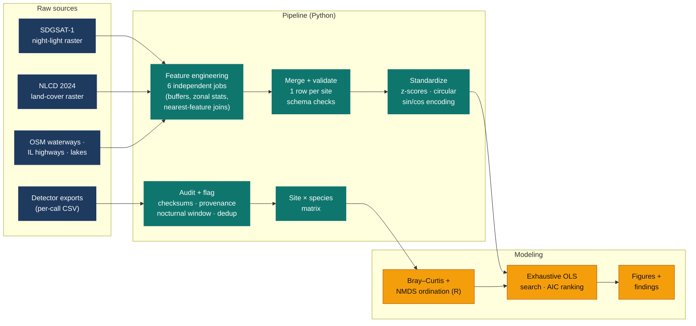
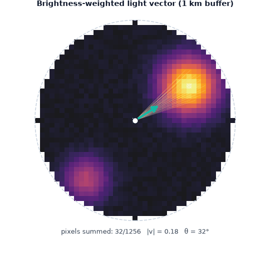
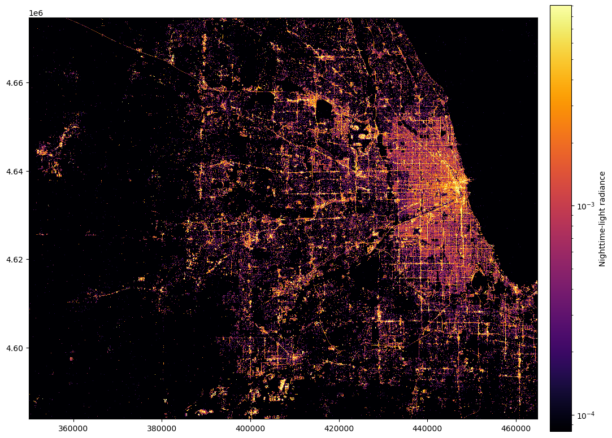
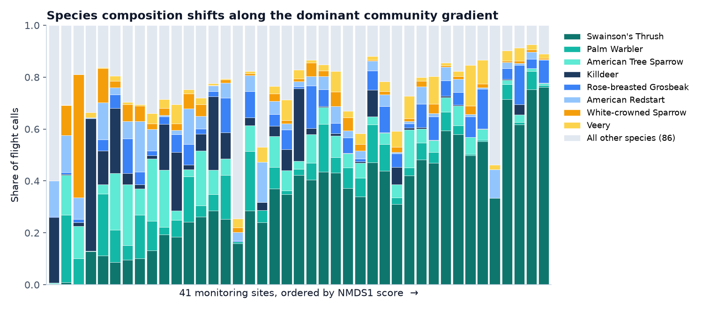
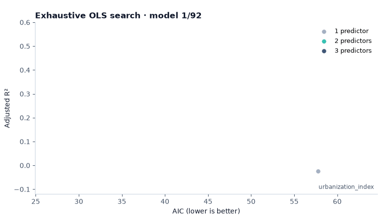
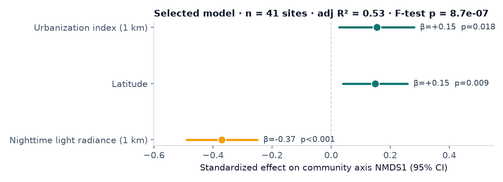

<p align="center">
  
</p>

<p align="center">
  
</p>

<p align="center">
  
  
  
  
  
  
</p>

<p align="center">
  
  
  
  
  
  
  
</p>

---

## TL;DR

Every night during migration, microphones across the Chicago region record thousands of bird flight calls, and an ML detector ([Nighthawk](https://github.com/bmvandoren/Nighthawk)) labels them by species. That leaves a question the raw data can't answer: **why do different parts of the city hear different birds?**

I built the pipeline that answers it:

1. **Ingest and audit** raw detector exports without ever mutating them
2. **Engineer 30+ spatial features** per site from satellite rasters and GIS vector layers
3. **Compress** a 41 × 94 site-by-species matrix into interpretable community axes
4. **Search 92 candidate regression models** and pick one by AIC, not by intuition

**Result:** a 3-predictor model explains **53% of the variation** in community composition (F-test p < 10⁻⁶). **Artificial light at night is the strongest driver**, with more than twice the effect size of any other predictor.

> Software & Data Engineering Intern · Windy City Bird Lab & [Van Doren Lab](https://www.vandorenlab.org/), NRES, University of Illinois · Jun 2025 – present

---

## Architecture



---

## 1 · Ingestion that can be audited

Raw exports come straight from the detection platform. They include duplicate annotations, family-level labels that overlap species-level ones, and calls recorded outside the nocturnal window. The ingestion layer ([`pipeline/family_calls/01_prepare_detections.py`](pipeline/family_calls/01_prepare_detections.py)) was designed so every downstream number can be traced back to a raw row.

| Design decision | Why it matters |
|:--|:--|
| **Raw files are never modified**; a SHA-256 checksum is recorded per input | Proves the source of truth hasn't drifted between runs |
| Every row carries **`_source_file` + `_source_row`** | Any count in a figure can be traced to the exact raw record |
| Problems are **flagged, not deleted** (`_flag_duplicate_annotation_id`, `_flag_outside_nocturnal_window`, `_flag_possible_group_taxon`, …) | Filtering is an explicit, reviewable step instead of a silent side effect |
| Species → family mapping is an **allow-list**; unknown taxa are exported for review | New species can't be silently miscounted, and family-level detections can't double-count species-level ones |
| Count tables are **zero-filled** across site × family | A family not heard at a sampled site is a real `0`, not a missing row, which count models need |

## 2 · Feature engineering from rasters and vectors

Six independent jobs ([`pipeline/environmental_variables/`](pipeline/environmental_variables)) each produce one tidy `site → features` table. They're then joined and validated.

| Job | Technique | Features |
|:--|:--|:--|
| `01_landcover_ntl` | 1 km buffers → categorical **zonal statistics** on NLCD; mean radiance on SDGSAT-1 | 15 land-cover proportions, `mean_radiance` |
| `02_river_distance` | `sjoin_nearest` against filtered OSM waterways | `distance_to_river_m`, `nearest_river` |
| `03_river_direction` | Snap site to river line → take a ±500 m substring → segment bearing | `river_bearing_sin/cos` |
| `04_lake_michigan` | Polygon boundary → point-to-shoreline distance | `dist_LakeMichigan` |
| `05_highway` | Nearest-feature join + buffer intersection count | `dist_to_highway_meter`, `highway_richness` |
| `06_light_vector` | Custom raster algorithm (below) | `light_x/y`, `magnitude`, `angle`, `weighted_light_distance_m` |

**Engineering details that prevent silent errors**

- **Everything is projected to UTM 16N (EPSG:26916)** before any distance or buffer operation. Buffering in lat/lon degrees would give distorted "1 km" circles.
- **Angles are encoded as (sin θ, cos θ)** instead of degrees, because 359° and 1° point almost the same way but are 358 apart as raw numbers.
- **The merge step fails fast**: it errors on any missing input file, any duplicate site key in any table, or missing required columns. Joins use `validate="one_to_one"`.
- **Standardization verifies itself** by asserting that every output column has mean 0 and SD 1. It refuses to run if there are NaNs or constant columns.

### Custom feature: the brightness-weighted light vector

Average brightness can't tell *which direction* the light is coming from, and that matters to a bird flying past a lit skyline. For every site, I crop the night-light raster to a 1 km disc and compute a brightness-weighted resultant vector:

$$
\vec{v} \;=\; \sum_i \frac{L_i}{\sum_j L_j}\,\hat{u}_i
\qquad
|\vec v| \in [0,1],\;\; \theta = \operatorname{atan2}(v_y, v_x)
$$

where $L_i$ is pixel radiance and $\hat u_i$ is the unit vector from the site to pixel $i$. $|\vec v|\approx 0$ means light is evenly spread around the site; $|\vec v|\to 1$ means it all comes from one side. The same weights give a brightness-weighted mean distance to light.

<p align="center">
  <br/>
  <sub>Illustration on synthetic radiance: pixels are accumulated brightest-first and the resultant vector settles toward the dominant light source.</sub>
</p>

<p align="center">
  <br/>
  <sub>The actual input: SDGSAT-1 nighttime radiance over the Chicago region (log scale, UTM 16N).</sub>
</p>

## 3 · From 94 species to two numbers per site

Comparing 41 sites across 94 species at once isn't readable. I used **Bray–Curtis dissimilarity** (how different two sites' call mixes are) and **NMDS ordination** to compress each site into coordinates that preserve those rank-order differences. The first axis, **NMDS1**, turns out to be a clear ecological gradient:

<p align="center">
  
</p>

Sites on the left are dominated by Killdeer, Palm Warbler and sparrows. On the right, Swainson's Thrush makes up more than 60% of calls. The next question is what in the environment moves a site along that axis.

## 4 · Model selection by search, not by hand

With 41 sites, a model with 15 predictors would overfit badly. Instead of hand-picking predictors, I fit **every 1-, 2- and 3-predictor OLS model** from 8 candidate predictors (92 models) and ranked them by AIC ([`modeling/model_selection.py`](modeling/model_selection.py)):

<p align="center">
  
</p>

Two things stand out:
- The models fall into **two clearly separated clusters**. Every model in the high-performing cluster contains `mean_radiance`, and no model without it explains much at all.
- The best model (`urbanization + night light + latitude`, AIC 27.9) is **more than 2 AIC units better** than the runner-up, and the top models all agree on the direction and size of the light effect.

<p align="center">
  
</p>

Collinearity was checked before modeling (VIF < 3 for all predictors). Land-cover redundancy was explored with PCA at 100 m, 1 km and 5 km scales ([`modeling/landcover_pca.py`](modeling/landcover_pca.py)).

## Findings

| | |
|:--|:--|
| 💡 **Light pollution** | The strongest predictor: brighter sites hold measurably different migrant communities |
| 🏙️ **Urban structure** | Development intensity has a smaller, independent effect |
| 🧭 **Geography** | Latitude captures a north–south gradient along the lake corridor |
| 🛣️ **Highways** | Little effect on composition within the study area |

These results are summarized in a research poster and support **light-pollution mitigation** as a lever for urban bird conservation.

---

## Repository layout

```text
.
├── pipeline/
│   ├── environmental_variables/   # 8-stage feature pipeline (01 → 08)
│   │   ├── 01_landcover_ntl.py    # zonal stats: NLCD + night light
│   │   ├── 02_river_distance.py
│   │   ├── 03_river_direction.py
│   │   ├── 04_lake_michigan.py
│   │   ├── 05_highway.py
│   │   ├── 06_light_vector.py     # custom raster algorithm
│   │   ├── 07_merge_predictors.py # validated join, one row per site
│   │   └── 08_standardize.py      # z-scores with self-verification
│   └── family_calls/
│       ├── 01_prepare_detections.py  # audited ingestion
│       └── 02_build_family_counts.py # allow-list mapping, zero-filled counts
├── modeling/
│   ├── landcover_pca.py
│   └── model_selection.py         # exhaustive AIC search
└── assets/                        # figures and animations in this README
```

```bash
pip install -r requirements.txt
python pipeline/environmental_variables/01_landcover_ntl.py   # ... through 08
python modeling/model_selection.py
```

> **Data availability:** The raw acoustic detections, monitoring-site coordinates and processed rasters belong to the lab and are not distributed here. This repository shows the code, methods and results. The satellite and GIS inputs (SDGSAT-1, NLCD, OpenStreetMap, Natural Earth) are public.

## Credits

Research by **Arina (Jingya) Zhou**, with Shu-Yueh Liao and Benjamin M. Van Doren · Department of Natural Resources & Environmental Sciences, University of Illinois Urbana-Champaign. Field data collection by J'orge Garcia (Windy City Bird Lab) and Madison Chudzik (Duke University). Funded by the Walder Foundation.

<p align="center">
  
</p>
